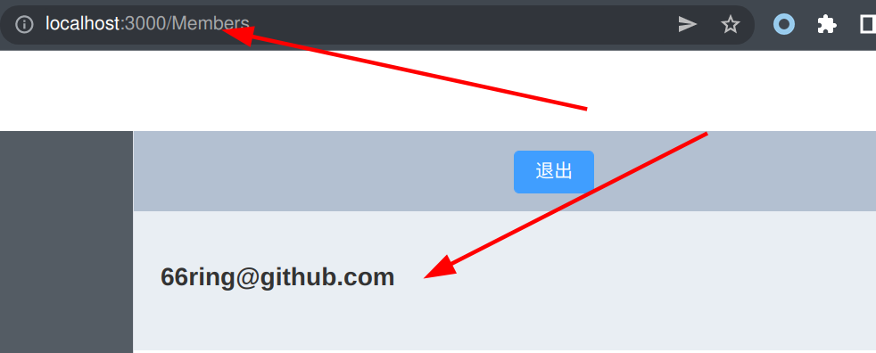
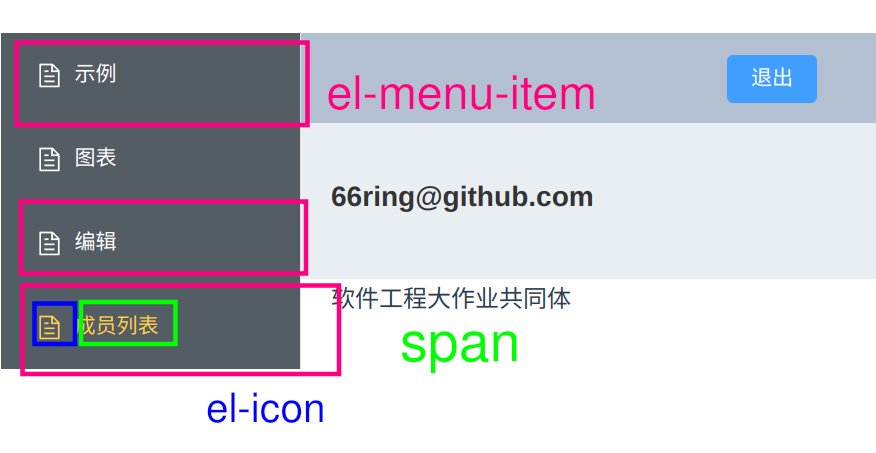

# 快速了解项目结构并接入开发

## vue的快速上手

强烈建立看看官网：https://staging-cn.vuejs.org/guide/essentials/template-syntax.html。

从模板语法开始看就行，看几节就查不到了。

一个`.vue`文件会有如下结构，它是html，javascript, css三位一体的。

```
<template>

</template>

<script>
export default {

}
</script>

<style lang="">

</style>
```

首先`<A 属性名="属性"> </A>`这样的一个对我们称之为一个tag，tag头没有`/`标识，tag尾有`/`。你的页面就是有一个个tag组成。你可以理解成一个tag就是一个对象，然后这个对象里可以由很多属性，传递信息的方式就是在tag头内部添加添加你要赋值的属性。

然后再来看看vue文件的结构。首先第一部分是一个`template`，这个tag里面就是你写html的地方。第二部分是`script`，这个tag是你写javascript的地方, javascript一般用于做一些html的更新，如改变页面颜色等。最后是`style`tag用来写css，css就是描述html该如何绘制的代码，如靠左，靠右等。

接下来看一段简易的vue代码快速上手

```
<template>
	<div>
		<h1>{{var1}}</h1>
		<button :type="type1" @click="func1"></button>
	</div>
</template>

<script>
export default {
	methods: {
		func1() {
			this.var1 = 3
		},
		func2() {},
		func3() {},
	},
	data() {
		var1=1,
		var2=2,
		type1 = "primary"
	},
}
</script>
```

`h1`tag是常用的"标题"(head)tag，同理还要`h2, h3..`，字体大小不同。可以看到`h1`里面有一个`{{var1}}`，这是vue的**双向绑定**，就是说`{{}}`里面的内容和var1的内容一样，当var1改变时`{{}}`里的内容就会改变。

接下来的`button`tag，有两个需要注意的地方`:type`表示将type1这个变量和type这个button的属性绑定，语法就是属性名前加`:`。然后是`@click`，属性名前加了`@`也是语法的一部分，表示这个属性会接收一个函数，并在调用是自动传递参数。一般`@click`就表示点击(click)按钮后触发的函数，这里掉函数`func1`将var1的值改为3，所以上面`h1`tag的内容就会发生改变。

再来看看javascript部分，也是遵循特殊的规则。首先看到一个`export default {}`，在js中`{}`就表示一个对象，所以该代码就是返回了一个对象，该对象就给vue用的, 不妨称之为"vue对象"吧。然后这个vue对象有一些固定的成员，如这里举例的两个`methods`和`data()`。methods表示vue对象都有哪些函数，有`func1`所以上面的`button`中`@click`可以调用到。然后是`data()`它没有`:`，直接是个函数，你需要用到的变量就声明在里面。


## 项目框架: 如何添加一个自己的页面

```
.
└── src
    ├── App.vue
    ├── assets
    ├── components
    ├── main.js
    ├── options.js
    ├── plugins
    ├── router
    ├── test.json
    └── views
```

你只需要关心`components`和`router`就可以了，其他基本不用修改。

假设我要添加一个团队成员名单的页面

1. 在`components`中创建页面(其实在哪里创都行): `Members.vue`，然后加了点内容，具体如下：
	```
	<template lang="">
		<div>
			<h1>66ring@github.com</h1>
		</div>
	</template>
	<script>
	export default {

	}
	</script>
	<style lang="">

	</style>
	```
1. 添加路由：修改`src/router/router.config.js`文件
	- 所谓路由就是你在浏览器地址栏输入一个路径时，用什么页面给你展示 
	- 首先要将我们刚才创建的页面引入，语法`import 名 from 路径`
		* `import Members from '../components/Members.vue'`
	- 然后可以看到`export default`，你只需要在`children`里面做修改就可以
	- 把刚才创建的页面添加到路由：在children数组中添加一个`{path: 'Members', component: Members}`
		* path表示路由名字，它的父path是`/`，那该页面的路径就是`/Members`
		* component表示展示的页表，是刚刚`import`的，就是我们创建的页面
		* 这时你在地址栏输入`http://localhost:3000/members`应该可以看到结构
		* 
2. 和项目组合
	- 我们项目有一个侧边栏，点击会跳到响应的页面
	- 修改在`src/components/admin/Nav.vue`
	- 在空白处添加如下模板，这么一个模板就相当于侧栏的一项
	```
	<el-menu-item index="/Members">
	<template #title>
	  <el-icon><document/></el-icon>
	  <span>成员列表</span>
	</template>
	</el-menu-item>
	```
	- `el-menu-item`的index属性就是点击后路由到的地发，就是刚刚在路由文件添加的
	- `<el-icon>`包裹的是图标，具体可以看官网都要什么图标，然后把`<document/>`图标修改就可以
	- `<span>`中可以写侧栏中的文字，这里是成员列表
	- 

